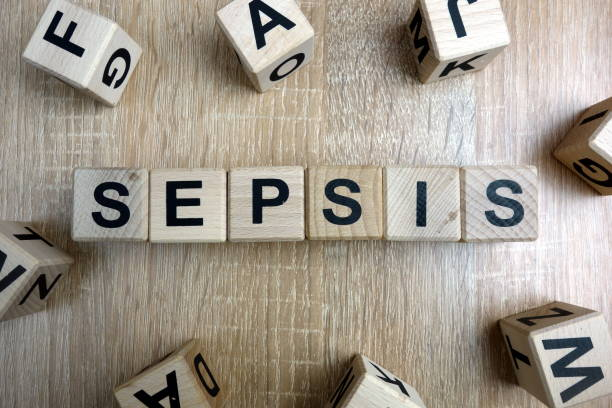

# Embedding-a-Machine-Learning-Model-in-A-Web-Applications
This is project that throws lights on the method of developing a web application for machine learning models

 </img>

# Introduction/Project Description 🎰

Sepsis is the body's extreme response to an infection. The use of AI and machine learning in disease prediction is very useful to the modern health industry since early prediction/ detection of disease is instrumental in avoid certain unseen bad events with patients. This project describes the use of machine learning to build a model that predict the sepsis status of a patient. The model is built on a historic patient data with identified sepsis status.
# Knowledge On Dataset 👨🏽‍💻
The datasets has ten features about a patient as seen below, including the sepsis feature that classifies a person with sepsis or not
- [ID: number to represent patient ID]
- [PRG: Plasma glucose]
- [PL: Blood Work Result-1 (mu U/ml)]
- [PR: Blood Pressure (mm Hg)]
- [SK: Blood Work Result-2 (mm)]
- [TS: Blood Work Result-3 (mu U/ml)]
- [M11: Body mass index (weight in kg/(height in m)^2]
- [BD2: Blood Work Result-4 (mu U/ml)]
- [Age: patients age (years)]
- [Insurance: If a patient holds a valid insurance card]
- [Sepsis: Positive: if a patient in ICU will develop a sepsis , and Negative: otherwise]

# Project Method and Setup 🚀

# Conclusion
